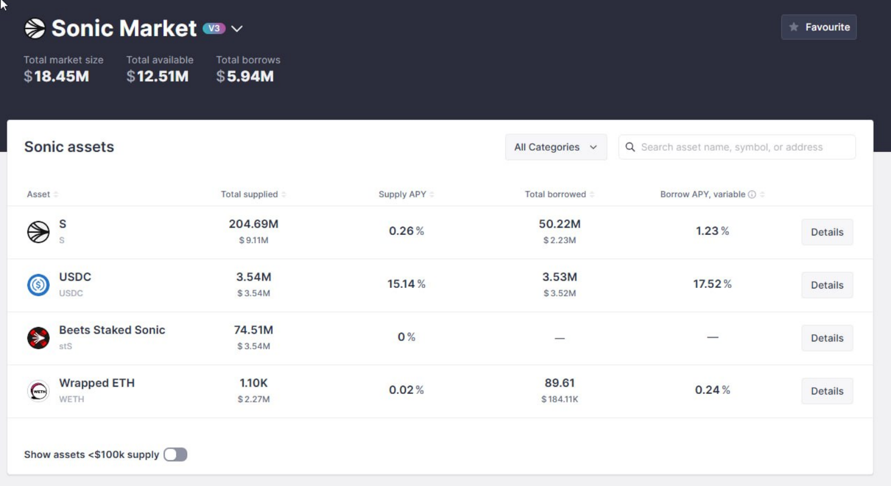

[27/05/2026 17:57] Paul: from the snapshot claude isn't finding anything either
[27/05/2026 17:57] Paul: i'm gonna have to find live examples to then see if the snapshots are lining up properly
[27/05/2026 18:07] Paul: on BSC chain there seems to be a profitable route
[27/05/2026 18:09] Paul: deposit USDT on Venus (+5%, some in shitcoin) -> borrow USDC (-2.45%) -> deposit USDC on Kinza.finance (7%, some in shitcoin) -> borrow  btcb (-0.5%) -> deposit the btcb on Venus again to borrow usdc -> deposit usdc on kinza.finance again
[27/05/2026 18:09] Paul: this considers shitcoins which you may not have been considering (I don't remember atm)
[27/05/2026 18:10] Paul: ill try to find an example that doesn't include shitcoins

[27/05/2026 18:23] Paul: there is definitely opportunity when we look cross-chain. Here we can deposit USDC on sonic for 15% and borrow this for 3-4% in another cheap chain :

---

[reply]

yeah you're right, I dug into it and found exactly what's going on.

DefiLlama just isn't counting the reward APY. for Venus, the data literally has the XVS token address sitting right there in the payload but reports the reward as 0%. so our snapshot only saw Venus's ~2% base and completely missed the ~3% in XVS you see on the actual UI. same with Kinza — rewards show up as null and it only sees like 200k TVL there. and Sonic Market, that 18M protocol in your screenshot? not even indexed by DefiLlama, it only has some tiny pools on the Sonic chain, not the real one.

so "no positive loops" was half the market actually drying up and half us being blind to the reward data. good catch, this changes how we build it.

couple flags on those routes before we get excited though:

that Sonic USDC at 15% isn't rewards, it's because the pool is at ~99.7% utilization. there's only like 10k left to withdraw out of 3.5M. so you'd earn the 15% but you could be stuck not being able to pull your money until people repay. the high APY is basically the pool paying you to be trapped. gotta check exit liquidity before putting size in.

and that BSC route uses BTCB in the middle, so that's bitcoin price exposure, the stuff we said we'd avoid. not saying don't, just that it's a different risk than pure stables.

the fix: we stop trusting DefiLlama for reward numbers. use it just to find what pools exist, then pull the real reward APY ourselves on-chain (read Venus's emission rate × XVS price ÷ TVL). I'll get you accurate numbers once that's hooked up.

---

[questions for Paul — send with the spec]

Spec attached. Most open items I can settle myself with data, but a few genuinely need your call — these change what we build, so flagging them specifically:

1. Cross-chain executability (most important). The cross-chain carry radar shows big theoretical spreads — e.g. USDC supply 13.5% on Canto vs borrow 0.28% on Cronos (+13%), USDT +4.6% (Avalanche/Cronos), GHO +5% (Plasma/Mantle). These are pre-bridge-cost ceilings. Which of these chains are actually usable in practice vs traps? i.e. can you realistically bridge in/out (Binance support or a trusted bridge), and do you trust the contracts on Canto / Cronos / Plasma / MegaETH / Mantle? I'd rather hard-exclude the untrustworthy ones in config than rank fantasy spreads.

2. Leverage formula. I'm getting 5.46x (0.855 per iter, 10 loops) but the original context doc says 6.60x. The difference is whether the 5% buffer reduces the per-iteration borrow (→5.46x) or is held as a separate reserve while you still borrow the full 90% (→6.60x). Which did you intend? Pinned in a test either way, just need the right number.

3. Per-platform reward schemes. You mentioned writing these out — that's exactly the "LAV" discount input I need. For the big ones (Venus/XVS, Aave/Merit, and any others you'd actually use): how often are you paid, is there vesting/lockup, can you sell the token without tanking it, any withdrawal penalty? That sets the haircut on the headline APY.

4. "Glitch" thresholds. I'm adding a sanity layer that flags pools with absurd data (so we don't rank a DefiLlama bug as an opportunity). From experience: above what supply APY do you assume it's a glitch/manipulated pool rather than real? And what single-snapshot TVL drop % should trip an alarm?

5. Chain + stablecoin allow/deny. Beyond the gas filter (we exclude ETH L1, Tron). Any chains you want hard-excluded for trust reasons regardless of yield? Any of these stables you wouldn't touch on depeg risk? (currently accepting USDT, USDC, USD1, USDe, DAI, USDS, GHO, PYUSD, crvUSD, RLUSD, FDUSD, TUSD, sUSDe, AUSD, USDT0, USDtb, +others)

---

[Paul's answers — 28/05 11:23-27]

1) cross-chain will only be later down the line. But it's good to know what's possible. Lets leave all chains as options for now, then we'll exclude them 1 by 1. If we have to bridge using a bridge that costs >$1 then we're not interested. Moving funds to binance, to then transfer off binance via another network is likely our cheapest bridge option. But this means we'd be limited to the networks that binance offers
2) This depends on the platform. It's not a static number. Each platform we're pulling interest rates from has a different LTV% per asset, which we'll need to discount 5% from
3) ok, what's the question here?
4) I'm not sure about this. Sometimes APY does go to crazy levels temporarily so big %'s might actually be real. We need to check the >50% cases each time they come up
5) We actually shouldn't exclude ETH L1, or Tron. both are relatively cheap chains now. We'll exclude some stablecoins that aren't the popular ones, but to start I want to see what's possible with all of them being considered

---

[reply — second round]

great, baking all of these in. quick acks + one follow-up on #3:

1. cross-chain — all chains stay in discovery. config gets a bridge_cost_usd per chain (Binance withdrawal fee), and the executable cross-chain analyzer gates on ≤$1. the radar still shows everything as ceilings so we see the universe.

2. leverage — switching from a single constant to per-pool: pulls each platform's LTV from DefiLlama, applies the 5% buffer per iter. each route shows its own leverage (binding LTV = lower of the two legs in a same-chain loop). makes a lot more sense than a global number.

4. high APY — switching from "filter out" to "flag for review". anything >50% supply APY surfaces in the dashboard with a yellow flag, doesn't get hidden. only clear nonsense (>10,000% APY, util >100%, etc.) gets filtered as "impossible".

5. chains/stables — no blacklist to start. accumulate exclusions as we observe issues.

3 (the one I need more from you): my question was too vague. let me ask concretely. for the 3-4 platforms you'd actually deploy on (best guesses: Venus, Aave, Morpho, Spark — correct me if different), for each main reward token can you fill in:

- payout cadence: per block, daily, weekly, only on claim?
- vesting/lockup: instant sale OK? cooldown days? linear vesting?
- sell liquidity: could you dump $10–50k of it without >2% slippage?
- withdrawal penalty on the underlying lending position (any cooldown to exit the deposit)?

that feeds the haircut we apply to the headline reward APY. e.g. XVS with a 7-day cooldown + thin liquidity → big discount. AAVE token instant + deep → no discount.

I can fill in the obvious ones (AAVE) myself; just need you to flag the ones with quirks. even a quick "Venus: claim only, ~$50k/day XVS liquidity, no withdraw penalty" per platform is enough.
